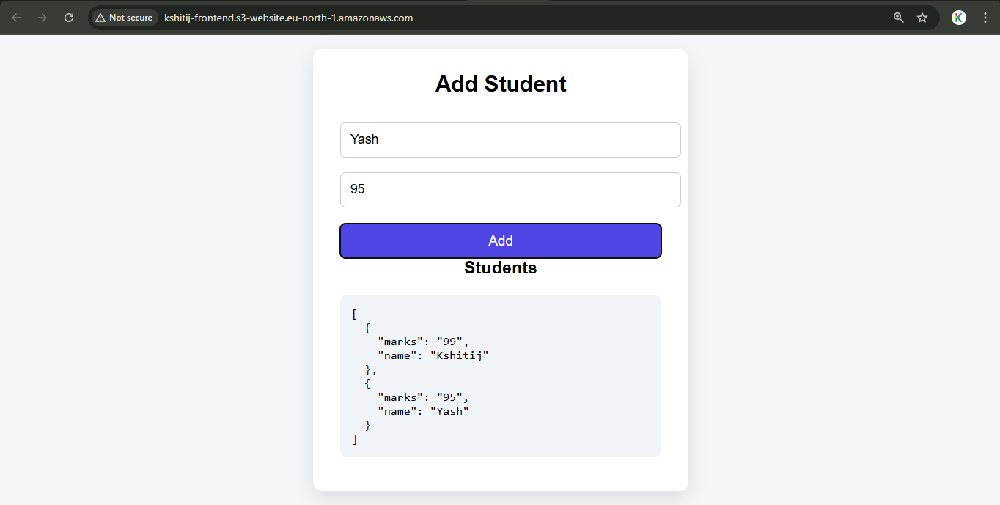

# 🎓 Student Management System - AWS Cloud Deployment

> My first cloud deployment project: Learning AWS services, CORS, security groups, and production architecture by deploying a full-stack application.



[](https://aws.amazon.com/)
[](https://flask.palletsprojects.com/)

---

## 🎯 About

This is a **learning project** focused on understanding cloud deployment, not application development. The code is simple (AI-assisted), but the real learning came from:

- Deploying to AWS from scratch
- Debugging CORS, security groups, and networking issues  
- Understanding how production systems work
- Linux server management via SSH

**Timeline:** 1 week (January 2026)  
**Goal:** Hands-on AWS experience

---

## 🏗️ Architecture
```
User → S3 (Frontend) → ALB (Load Balancer) → EC2 (Flask API)
```

**Services Used:**
- AWS EC2 (t2.micro) - Backend hosting
- AWS S3 - Static website hosting
- AWS ALB - Load balancing
- Security Groups - Network security


---

## 🛠️ Tech Stack

**Frontend:** HTML, JavaScript  
**Backend:** Python, Flask, Flask-CORS  
**Cloud:** AWS (EC2, S3, ALB, VPC, Security Groups)  
**Tools:** Git, SSH, MobaXterm

---

## 🧠 What I Learned

### AWS Hands-On
- Launched and configured EC2 instances
- Set up S3 static website hosting
- Configured Application Load Balancer with target groups
- Managed Security Groups and network access

### Key Debugging Wins
- **CORS Configuration:** Learned why cross-origin requests need explicit permission
- **Security Groups:** Fixed "Target Unhealthy" by allowing ALB → EC2 traffic
- **URL Typo:** Missing `http://` made browser use relative URL (got 404 instead of JSON)
- **Systematic Debugging:** Checked each layer (app → EC2 → security groups)

### Production Concepts
- Difference between static hosting (S3) and compute (EC2)
- How load balancers route traffic and check health
- Linux server management and SSH access
- Git version control and Python virtual environments

---

## 🐛 Main Challenges

**1. Missing Protocol in URL**
```javascript
// ❌ Wrong - Browser treats as relative URL
fetch("alb-dns.com/students")

// ✅ Fixed - Always use full URL
fetch("http://alb-dns.com/students")
```

**2. Security Group Misconfiguration**
- ALB couldn't reach EC2 - target showed "unhealthy"
- Fixed by allowing port 5000 from ALB security group

**3. CORS Errors**
- Browser blocked cross-origin requests
- Fixed with `Flask-CORS` library

---

## 🚀 Quick Setup

**Backend (EC2):**
```bash
ssh -i key.pem ec2-user@<ec2-ip>
sudo yum update -y
sudo yum install python3 git -y
git clone <repo-url>
cd backend
python3 -m venv venv
source venv/bin/activate
pip install -r requirements.txt
python3 app.py
```

**Frontend (S3):**
- Create bucket, enable static hosting
- Upload `index.html`
- Make bucket public
- Update ALB DNS in JavaScript

Detailed guide: See comments in code files

---

## 📸 Screenshots

| EC2 Dashboard | ALB Configuration | Working App |
|---------------|-------------------|-------------|
|  |  |  |

---

## 💰 Cost

**1 Week Usage:**
- EC2 t2.micro: $0 (free tier)
- S3: ~$0.02
- ALB: ~$4 (pro-rated)
- **Total: ~$4.50**

⚠️ ALB is expensive for learning - deleted after project!

---

## 🔒 Security Notes

**This is a learning project with limitations:**
- No HTTPS (HTTP only)
- No authentication
- In-memory storage
- No input validation

**For production, add:** Database (RDS), HTTPS (ACM), authentication, monitoring, etc.

---

## 📈 Next Steps

- [ ] Build CI/CD pipeline with GitHub Actions
- [ ] Add Terraform for Infrastructure as Code
- [ ] Implement proper database (RDS)
- [ ] Add monitoring with CloudWatch
- [ ] Deploy with Docker + ECS

---

## 🙏 Resources

- [AWS Zero to Hero - Abhishek Veeramalla](https://youtube.com/@AbhishekVeeramalla)
- [AWS Documentation](https://docs.aws.amazon.com/)
- [Flask Docs](https://flask.palletsprojects.com/)

---

## 📝 License

MIT License - Feel free to use for learning!

---

**Built by Kshitij Khule** | [GitHub](https://github.com/kshitij-khule) | [LinkedIn](your-linkedin)

---

⭐ **If this helped you understand AWS deployment, give it a star!**

*Note: Application code is AI-assisted. Focus is on cloud infrastructure and deployment concepts.*